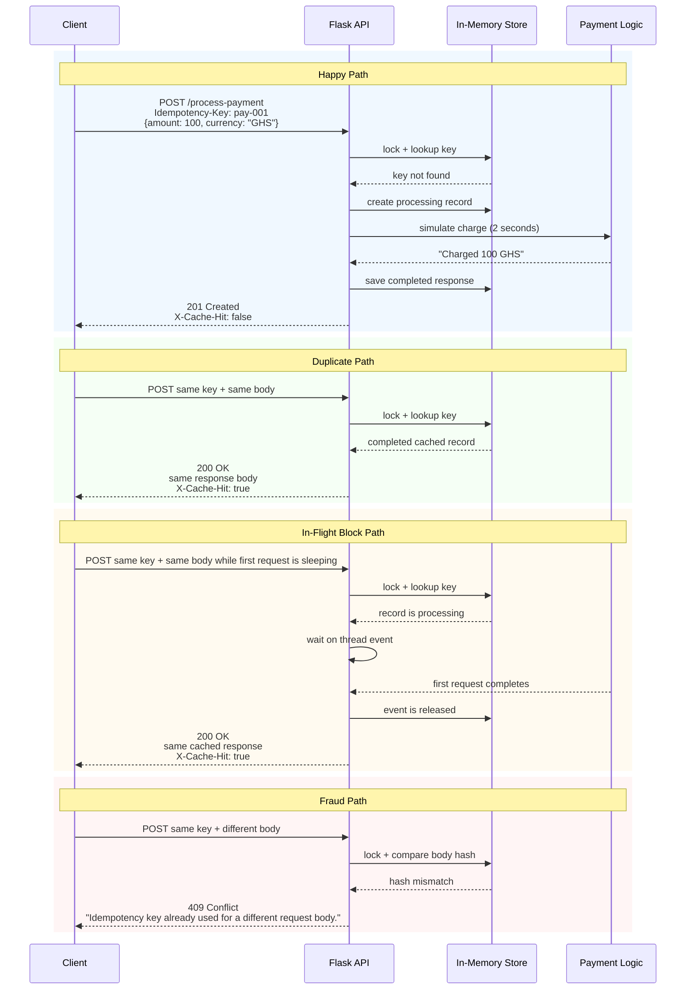

# Idempotency-Gateway: The "Pay-Once" Protocol

This project is a Flask-based payment simulation service that guarantees a payment request is processed once per `Idempotency-Key`, even if the client retries because of timeouts or flaky networks.

It is designed to protect a payment processor from accidental double charging by caching the first successful result and replaying it safely for duplicates.

## System Flow



## Features

- `POST /process-payment` enforces idempotent payment processing.
- Requires an `Idempotency-Key` request header.
- Uses a thread-safe in-memory dictionary protected by `threading.Lock()`.
- Simulates payment execution with a 2-second delay for the first request only.
- Returns cached responses immediately for exact duplicates.
- Blocks and safely replays the result for in-flight duplicate requests.
- Rejects same-key requests with different bodies using `409 Conflict`.
- Provides an admin endpoint to manually evict cached idempotency keys.

## Tech Stack

- Python 3
- Flask
- Standard library concurrency primitives: `threading.Lock()` and `threading.Event()`

## Project Files

- [app.py](./app.py): Flask application and idempotency logic
- [requirements.txt](./requirements.txt): Python dependencies
- [README.md](./README.md): Documentation

## Local Installation

### 1. Create and activate a virtual environment

Windows PowerShell:

```powershell
python -m venv .venv
.venv\Scripts\Activate.ps1
```

macOS/Linux:

```bash
python3 -m venv .venv
source .venv/bin/activate
```

### 2. Install dependencies

```bash
pip install -r requirements.txt
```

### 3. Start the server

```bash
python app.py
```

The API runs on:

```text
http://localhost:5000
```

## API Documentation

### `POST /process-payment`

Processes a payment exactly once for each unique `Idempotency-Key`.

#### Required Header

```http
Idempotency-Key: <unique-string>
```

#### Example Request Body

```json
{
  "amount": 100,
  "currency": "GHS"
}
```

#### First Request Response

Status:

```http
201 Created
X-Cache-Hit: false
```

Body:

```json
{
  "message": "Charged 100 GHS"
}
```

#### Duplicate Request With Same Key And Same Body

Status:

```http
200 OK
X-Cache-Hit: true
```

Body:

```json
{
  "message": "Charged 100 GHS"
}
```

#### Same Key With Different Body

Status:

```http
409 Conflict
```

Body:

```json
{
  "error": "Idempotency key already used for a different request body."
}
```

### `DELETE /admin/idempotency-keys/<key>`

Manually removes a completed idempotency key from memory.

Successful response:

```json
{
  "message": "Idempotency key 'pay-001' deleted."
}
```

If the key does not exist:

```json
{
  "error": "Idempotency key not found."
}
```

If the key is still being processed:

```json
{
  "error": "Cannot evict a key that is currently processing."
}
```

## curl Commands

### 1. Happy Path

```bash
curl -X POST http://localhost:5000/process-payment \
  -H "Content-Type: application/json" \
  -H "Idempotency-Key: pay-001" \
  -d "{\"amount\":100,\"currency\":\"GHS\"}"
```

### 2. Duplicate Request

Run the exact same command again:

```bash
curl -X POST http://localhost:5000/process-payment \
  -H "Content-Type: application/json" \
  -H "Idempotency-Key: pay-001" \
  -d "{\"amount\":100,\"currency\":\"GHS\"}"
```

Expected result:

- no 2-second delay
- `200 OK`
- `X-Cache-Hit: true`

### 3. Fraud Check

```bash
curl -X POST http://localhost:5000/process-payment \
  -H "Content-Type: application/json" \
  -H "Idempotency-Key: pay-001" \
  -d "{\"amount\":500,\"currency\":\"GHS\"}"
```

Expected result:

- `409 Conflict`
- error message stating the key was used for a different body

### 4. In-Flight Race Condition

Open two terminals and run these commands almost at the same time.

Terminal 1:

```bash
curl -X POST http://localhost:5000/process-payment \
  -H "Content-Type: application/json" \
  -H "Idempotency-Key: pay-race-001" \
  -d "{\"amount\":250,\"currency\":\"USD\"}"
```

Terminal 2, immediately after Terminal 1:

```bash
curl -X POST http://localhost:5000/process-payment \
  -H "Content-Type: application/json" \
  -H "Idempotency-Key: pay-race-001" \
  -d "{\"amount\":250,\"currency\":\"USD\"}"
```

Expected result:

- Terminal 1 waits about 2 seconds and returns `201 Created`
- Terminal 2 does not start a new charge
- Terminal 2 waits for Terminal 1 to finish
- Terminal 2 returns the cached result with `200 OK` and `X-Cache-Hit: true`

### 5. Admin Eviction

```bash
curl -X DELETE http://localhost:5000/admin/idempotency-keys/pay-001
```

## Design Decisions

### 1. In-Memory Dictionary With `threading.Lock()`

The assignment explicitly requested a local, thread-safe store. A shared Python dictionary guarded by a global `threading.Lock()` keeps the design simple, deterministic, and fully compliant with the brief.

### 2. Canonical Body Hashing

Request bodies are converted into a stable JSON string with sorted keys and hashed using SHA-256. This prevents false mismatches caused by object key ordering and gives a reliable way to decide whether two requests are truly the same.

### 3. Safe In-Flight Coordination

When the first request starts processing, it creates a record with status `processing` and a `threading.Event()`. Any duplicate request with the same key and same body waits on that event. Once the first request finishes, the event is released and waiting callers receive the cached result instead of triggering a second charge.

### 4. Response Semantics

- First successful request returns `201 Created` with `X-Cache-Hit: false`
- Cached duplicates return `200 OK` with `X-Cache-Hit: true`
- Conflicting duplicates return `409 Conflict`

This makes it easy for clients and reviewers to see whether a response came from fresh processing or replay.

## Developer's Choice Feature

### Administrative Key Eviction

I added:

```http
DELETE /admin/idempotency-keys/<key>
```

This gives support or operations staff a direct way to remove a completed idempotency key from memory when they need to clear stale entries manually.

Why this is useful in a real fintech environment:

- support teams sometimes need operational tools without restarting the service
- stale cached keys can be cleared intentionally after investigation
- it provides a simple manual recovery path during demos, testing, or incident handling

Safety note:

- the endpoint refuses to evict keys that are still `processing`
- this preserves exactly-once behavior and avoids introducing a second charge while a live request is still in flight

## Example Success Criteria Mapping

- User Story 1: supported by `POST /process-payment` with a 2-second processing delay and `201 Created`
- User Story 2: supported by cached replay with `200 OK` and `X-Cache-Hit: true`
- User Story 3: supported by SHA-256 body comparison and `409 Conflict`
- Bonus Story: supported by blocking duplicate callers on a shared thread event until the first request completes

## How To Submit

1. Push this repository to your public GitHub fork.
2. Confirm the README is the only documentation file reviewers need.
3. Verify the server starts with `python app.py`.
4. Test the endpoints using the curl commands above.
5. Submit the GitHub repository link.
