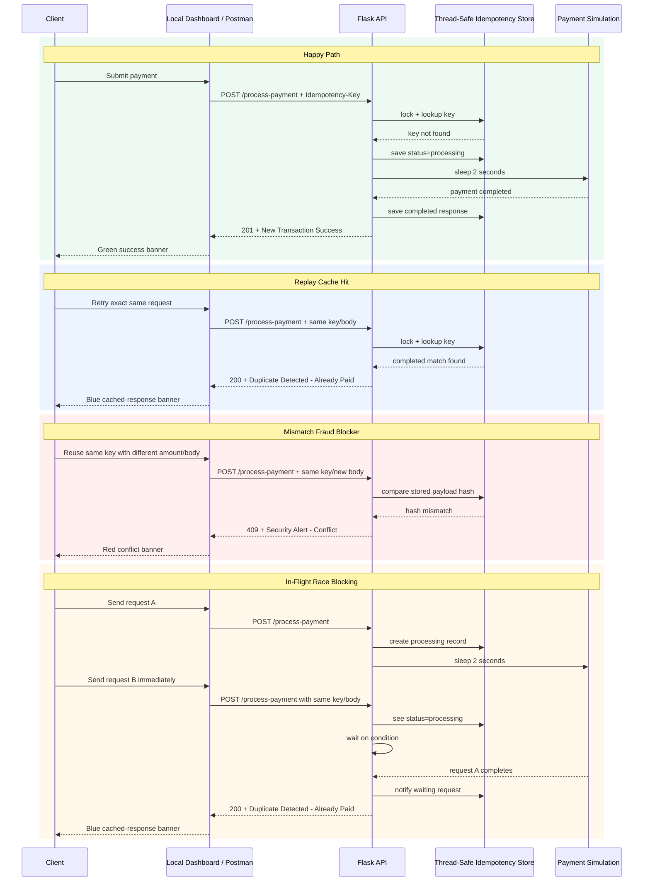

# FinSafe Idempotency Gateway

## 1. Project Title & Overview

FinSafe Transactions Ltd. needs a safety layer in front of payment processing so merchants can retry a slow or timed-out payment request without charging the customer twice.

This Flask project solves that problem on a local machine with a thread-safe idempotency gateway:

- the first request for a key is processed once
- safe retries return a clear duplicate message without charging again
- if someone uses the same key with different payment details, the request is blocked
- if two matching requests arrive at almost the same time, the second one waits for the first one to finish
- saved idempotency keys expire automatically after 24 hours so memory does not keep growing forever

The project also includes a built-in browser dashboard, so you can test the API in a web page as well as in Postman or curl.

## 2. Architecture Diagram



## 3. Setup & Installation Instructions

### Prerequisites

- Python 3.10+
- `pip`

### Install locally

Windows PowerShell:

```powershell
python -m venv .venv
.venv\Scripts\Activate.ps1
pip install -r requirements.txt
```

macOS / Linux:

```bash
python3 -m venv .venv
source .venv/bin/activate
pip install -r requirements.txt
```

### Start the application

```bash
python app.py
```

The app will be available at:

```text
http://localhost:5000
```

### Quick TTL demo mode

The normal cache lifetime is 24 hours. For a fast demo, you can run the app with a 1-minute TTL:

Windows PowerShell:

```powershell
$env:IDEMPOTENCY_TTL_SECONDS=60
python app.py
```

macOS / Linux:

```bash
IDEMPOTENCY_TTL_SECONDS=60 python app.py
```

In this mode, a saved key will disappear after 1 minute, so you can watch the payment become "new" again without waiting 24 hours.

### Run the unit tests

```bash
python -m unittest test_app.py
```

## 4. API Documentation

### Endpoints

| Method | Endpoint | Purpose |
| --- | --- | --- |
| `GET` | `/` | Serves the local dashboard |
| `POST` | `/process-payment` | Processes a payment exactly once per idempotency key |
| `DELETE` | `/admin/idempotency-keys/<key>` | Manually evicts a completed key from memory |

### Required Headers For `POST /process-payment`

| Header | Required | Description |
| --- | --- | --- |
| `Content-Type: application/json` | Yes | Declares a JSON request body |
| `Idempotency-Key` | Yes | Unique transaction replay key |

### Sample Request Body

```json
{
  "amount": 100,
  "currency": "GHS"
}
```

### Response Examples

#### Happy Path

HTTP:

```http
201 Created
X-Cache-Hit: false
```

Body:

```json
{
  "status": "New Transaction Success",
  "message": "Charged 100 GHS"
}
```

#### Replay Cache Hit

HTTP:

```http
200 OK
X-Cache-Hit: true
```

Body:

```json
{
  "status": "Duplicate Detected - Already Paid",
  "message": "Charged 100 GHS"
}
```

#### Mismatch Fraud Blocker

HTTP:

```http
409 Conflict
```

Body:

```json
{
  "status": "Security Alert - Conflict",
  "message": "Idempotency key already used for a different request body."
}
```

#### Admin Cache Eviction Success

HTTP:

```http
200 OK
```

Body:

```json
{
  "status": "Admin Success",
  "message": "Key manually evicted from cache."
}
```

### Cache lifetime

Completed idempotency keys are kept for 24 hours.

- if the same key and same body come back during that time, the saved result is replayed
- once the 24-hour window passes, the key is removed automatically
- after that, the same request is treated like a brand-new payment again

For quick testing, you can set `IDEMPOTENCY_TTL_SECONDS=60` before starting the app. That changes the cache life to 1 minute so the automatic cleanup is easier to see.

### Manual Testing With curl

#### New transaction

```bash
curl -X POST http://localhost:5000/process-payment \
  -H "Content-Type: application/json" \
  -H "Idempotency-Key: pay-001" \
  -d "{\"amount\":100,\"currency\":\"GHS\"}"
```

#### Duplicate replay

Run the same request again:

```bash
curl -X POST http://localhost:5000/process-payment \
  -H "Content-Type: application/json" \
  -H "Idempotency-Key: pay-001" \
  -d "{\"amount\":100,\"currency\":\"GHS\"}"
```

#### Conflict test

```bash
curl -X POST http://localhost:5000/process-payment \
  -H "Content-Type: application/json" \
  -H "Idempotency-Key: pay-001" \
  -d "{\"amount\":500,\"currency\":\"GHS\"}"
```

#### TTL expiry test

1. Send the normal payment request once.
2. Wait until the TTL window ends.
3. Send the same request again.

Expected result:

- with the default setup, wait 24 hours
- with `IDEMPOTENCY_TTL_SECONDS=60`, wait 1 minute
- after the key expires, the same payment is treated as new again and returns `201 Created`

#### Admin eviction

```bash
curl -X DELETE http://localhost:5000/admin/idempotency-keys/pay-001
```

## 5. Design Decisions

### Thread-safe dictionary

The brief asked for a local in-memory solution. A shared Python dictionary protected by a `threading.Lock()` keeps access safe and predictable inside one Flask app process.

### Payload hashing

The request body is cleaned into a stable JSON format and hashed with SHA-256 before comparison. This stops false mismatches caused by different key order in JSON and makes duplicate checks reliable.

### Separate HTTP codes and descriptive status strings

The API uses strict HTTP status codes for machine-readable behavior:

- `201` for a brand-new processed transaction
- `200` for a replayed duplicate
- `409` for a conflict caused by key reuse with a different payload

At the same time, every JSON response includes a clear `status` string written in plain English so the result is easy to understand in the dashboard, Postman, or during a demo.

### Graceful in-flight blocking

When a second identical request arrives during the 2-second processing window, it waits on a `threading.Condition()` until the first request finishes. This prevents duplicate work and avoids a race-condition bug.

### 24-hour cache expiration

Each stored key gets an `expires_at` timestamp set to 24 hours from the moment it is created or completed. Before the gateway handles a new payment or an admin delete request, it removes any expired keys from memory. This keeps the local store small and stops old entries from living forever.

### Built-in dashboard

The root route serves a local HTML dashboard so the project can be shown and tested without building a separate frontend. It uses `fetch()` to call the same API routes used by Postman.

The dashboard also explains the 4 main cases in plain English:

- a new payment
- a duplicate payment
- a blocked conflict
- an expired key that becomes usable again

## 6. The Developer's Choice

This project now includes two extra safety features beyond the main idempotency flow.

### Feature 1: Support Admin Reset Button

The first extra feature is:

```http
DELETE /admin/idempotency-keys/<key>
```

It was added because real payment systems need more than correct payment logic. They also need support tools.

### Why this helps in practice

- operations teams may need to clear old saved records during testing or issue handling
- support staff may need a safe manual reset path without restarting the service
- QA teams can repeat the same payment flow quickly after removing a completed key

### Safety guard

The endpoint refuses to remove a key that is still marked as `processing`. This stops someone from deleting a live transaction record and accidentally making a second charge possible.

### Feature 2: 24-Hour Automated Cache Lifespan

The second extra feature is automatic cache expiration.

Every saved idempotency key gets a 24-hour time-to-live window. When that time passes, the gateway removes the key from memory the next time cleanup runs.

### Why this helps in practice

- old payment keys do not stay in RAM forever
- the local service stays easier to manage over time
- the replay window is clear and predictable
- once a key expires, the same payment can be handled as a fresh transaction again

For demos and local testing, the TTL can also be shortened to 60 seconds with `IDEMPOTENCY_TTL_SECONDS=60`.
```
