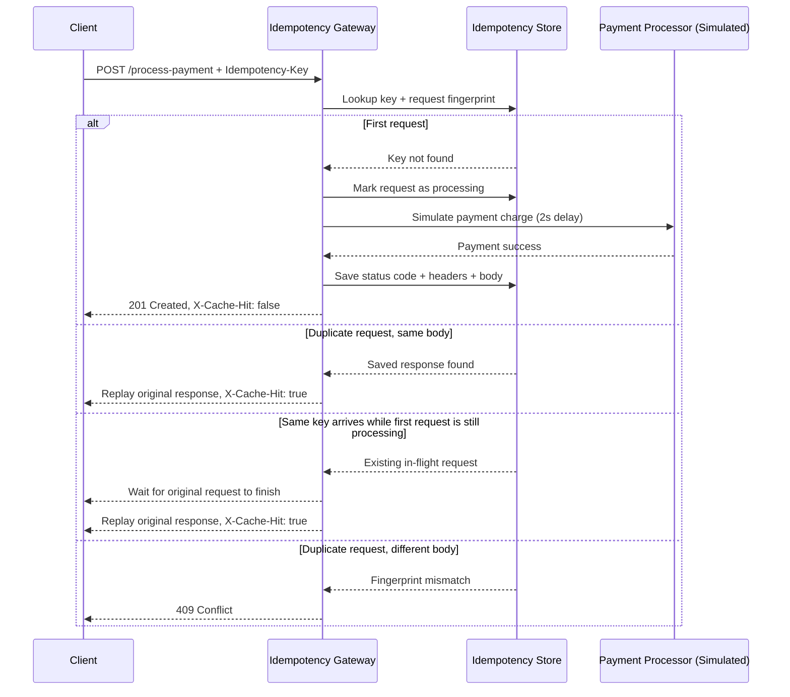

# Idempotency Gateway

A lightweight payment gateway simulation that guarantees a payment request is processed exactly once per `Idempotency-Key`.

It protects merchants from double charging when they retry a timed-out payment request. The first request is processed with a simulated delay, and every safe retry returns the original response immediately without charging again.

## Architecture Diagram



## Features

- `POST /process-payment` processes a payment exactly once per idempotency key.
- Duplicate requests with the same key and same JSON body replay the saved response instantly.
- Requests that reuse a key with a different body are rejected with `409 Conflict`.
- In-flight duplicates wait for the first request to finish, then receive the same result.
- Built-in request validation protects the API from malformed payment payloads.
- Configurable TTL cleanup prevents idempotency records from living forever in memory.

## Tech Stack

- Node.js built-in `http` server
- In-memory `Map`-backed idempotency store
- Node.js built-in test runner (`node --test`)

No third-party dependencies are required.

## Setup Instructions

### Prerequisites

- Node.js 18+ (tested with Node.js 24)

### Run locally

```bash
npm start
```

The API starts on `http://localhost:3000` by default.

### Run tests

```bash
npm test
```

## Environment Variables

| Variable | Default | Purpose |
| --- | --- | --- |
| `PORT` | `3000` | HTTP server port |
| `PROCESSING_DELAY_MS` | `2000` | Simulated payment processing delay |
| `IDEMPOTENCY_TTL_MS` | `86400000` | Time to keep completed idempotency records in memory |

## API Documentation

### `POST /process-payment`

Processes a payment request once and safely replays the same result for retries.

#### Required Headers

| Header | Description |
| --- | --- |
| `Content-Type: application/json` | Request body format |
| `Idempotency-Key: <unique-string>` | Unique key used to deduplicate retries |

#### Request Body

```json
{
  "amount": 100,
  "currency": "GHS"
}
```

#### Successful First Request

```http
POST /process-payment
Idempotency-Key: pay-123
Content-Type: application/json
```

```json
{
  "amount": 100,
  "currency": "GHS"
}
```

Response:

```http
HTTP/1.1 201 Created
Content-Type: application/json; charset=utf-8
X-Cache-Hit: false
```

```json
{
  "message": "Charged 100 GHS",
  "paymentId": "3ac84f9d-2ea0-4c9c-b9f0-5a77d8bf8ee7",
  "idempotencyKey": "pay-123",
  "processedAt": "2026-05-23T08:00:00.000Z"
}
```

#### Duplicate Request With Same Key And Same Body

The second request returns the original body and status code immediately.

```http
HTTP/1.1 201 Created
Content-Type: application/json; charset=utf-8
X-Cache-Hit: true
```

```json
{
  "message": "Charged 100 GHS",
  "paymentId": "3ac84f9d-2ea0-4c9c-b9f0-5a77d8bf8ee7",
  "idempotencyKey": "pay-123",
  "processedAt": "2026-05-23T08:00:00.000Z"
}
```

#### Same Key With Different Body

```http
HTTP/1.1 409 Conflict
Content-Type: application/json; charset=utf-8
```

```json
{
  "error": "Idempotency key already used for a different request body."
}
```

#### Validation Error Example

```http
HTTP/1.1 400 Bad Request
Content-Type: application/json; charset=utf-8
```

```json
{
  "error": "currency must be a 3-letter uppercase ISO code."
}
```

### `GET /health`

Simple liveness endpoint.

Response:

```json
{
  "status": "ok"
}
```

## Example cURL Commands

### First payment request

```bash
curl -X POST http://localhost:3000/process-payment \
  -H "Content-Type: application/json" \
  -H "Idempotency-Key: pay-001" \
  -d "{\"amount\":100,\"currency\":\"GHS\"}"
```

### Safe retry using the same idempotency key

```bash
curl -X POST http://localhost:3000/process-payment \
  -H "Content-Type: application/json" \
  -H "Idempotency-Key: pay-001" \
  -d "{\"amount\":100,\"currency\":\"GHS\"}"
```

### Rejected conflicting retry

```bash
curl -X POST http://localhost:3000/process-payment \
  -H "Content-Type: application/json" \
  -H "Idempotency-Key: pay-001" \
  -d "{\"amount\":500,\"currency\":\"GHS\"}"
```

## Design Decisions

### 1. Canonical Request Fingerprinting

The gateway creates a stable SHA-256 fingerprint from the JSON payload. This avoids false mismatches caused by object key order differences and makes body comparison deterministic.

### 2. In-Memory Coordination With Waiters

Each active idempotency key stores its processing state. If a second identical request arrives while the first one is still running, it waits on the same promise instead of starting another payment flow.

### 3. Replaying The Saved HTTP Response

The store keeps the original status code, headers, and serialized body. This guarantees duplicate callers receive the same business result as the first successful request.

### 4. Simple By Design

The current solution uses an in-memory store because the challenge allows it and it keeps the logic easy to review. In production, the same pattern should move to Redis or a database-backed store shared across all application instances.

## Developer's Choice

### Expiring Idempotency Records

I added TTL-based eviction for completed idempotency keys.

Why this matters for a real fintech system:

- It prevents memory growth from unbounded idempotency history.
- It defines a clear replay window for clients.
- It keeps operational behavior predictable under sustained traffic.

The TTL is configurable with `IDEMPOTENCY_TTL_MS`, so the replay retention window can be tuned without changing code.

## Test Coverage

Automated tests cover:

- first-time successful payment processing
- duplicate replay behavior
- conflicting body reuse with the same key
- concurrent duplicate requests during the in-flight window

## Production Hardening Ideas

- move the idempotency store to Redis for multi-instance deployments
- persist payment audit logs to a database
- add authentication and rate limiting
- expose metrics for cache hits, conflicts, and processing time
