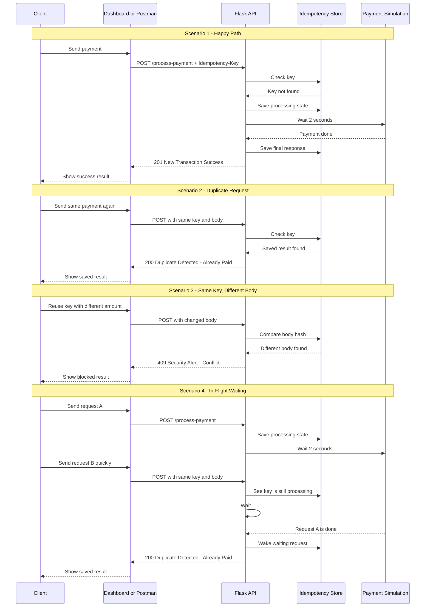

# FinSafe Idempotency Gateway

## 1. Project Title & Overview

FinSafe Transactions Ltd. needs a way to stop double charging.

Sometimes a shop sends a payment request, the network becomes slow, and the shop sends the same request again. If the backend processes both requests, the customer can be charged twice.

This project solves that problem with a local Flask app.

What it does:

- the first request is processed normally
- if the same request comes again, the app returns the saved result
- if the same key is used with different payment details, the app blocks it
- if two same requests come at almost the same time, the second one waits for the first one to finish
- saved keys expire automatically so memory does not keep growing forever

This project also has a simple browser dashboard, so you can test it in the browser, in Postman, or with curl.

## 2. Architecture Diagram



## 3. Setup & Installation Instructions

### What you need

- Python 3.10 or higher
- pip

### Install the project

Windows PowerShell:

```powershell
python -m venv .venv
.venv\Scripts\Activate.ps1
pip install -r requirements.txt
```

macOS / Linux:

```bash
python3 -m venv .venv
source .venv/bin/activate
pip install -r requirements.txt
```

### Start the app

```bash
python app.py
```

Open it here:

```text
http://localhost:5000
```

### Run tests

```bash
python -m unittest test_app.py
```

### Quick TTL test mode

The normal saved-key life is 24 hours. If you want to test expiry quickly, run the app with a 1-minute TTL.

Windows PowerShell:

```powershell
$env:IDEMPOTENCY_TTL_SECONDS=60
python app.py
```

macOS / Linux:

```bash
IDEMPOTENCY_TTL_SECONDS=60 python app.py
```

In this mode, a saved key will expire after 1 minute.

## 4. API Documentation

### Endpoints

| Method | Endpoint | What it does |
| --- | --- | --- |
| `GET` | `/` | Opens the local dashboard |
| `POST` | `/process-payment` | Processes a payment once for each key |
| `DELETE` | `/admin/idempotency-keys/<key>` | Removes a saved key by hand |

### Required headers for `POST /process-payment`

| Header | Required | Meaning |
| --- | --- | --- |
| `Content-Type: application/json` | Yes | Tells the server the body is JSON |
| `Idempotency-Key` | Yes | The unique payment key |

### Example request body

```json
{
  "amount": 100,
  "currency": "GHS"
}
```

### Response examples

#### 1. New payment

HTTP:

```http
201 Created
X-Cache-Hit: false
```

Body:

```json
{
  "status": "New Transaction Success",
  "message": "Charged 100 GHS"
}
```

#### 2. Same payment sent again

HTTP:

```http
200 OK
X-Cache-Hit: true
```

Body:

```json
{
  "status": "Duplicate Detected - Already Paid",
  "message": "Charged 100 GHS"
}
```

#### 3. Same key, different body

HTTP:

```http
409 Conflict
```

Body:

```json
{
  "status": "Security Alert - Conflict",
  "message": "Idempotency key already used for a different request body."
}
```

#### 4. Admin key delete

HTTP:

```http
200 OK
```

Body:

```json
{
  "status": "Admin Success",
  "message": "Key manually evicted from cache."
}
```

### Saved key lifetime

Saved keys stay for 24 hours by default.

- if the same key and same body come back in that time, the old result is returned
- when the time ends, the key is removed automatically
- after that, the same payment is treated like a new payment again

For quick testing, you can set `IDEMPOTENCY_TTL_SECONDS=60` and use a 1-minute lifetime.

### Manual curl tests

#### New payment

```bash
curl -X POST http://localhost:5000/process-payment \
  -H "Content-Type: application/json" \
  -H "Idempotency-Key: pay-001" \
  -d "{\"amount\":100,\"currency\":\"GHS\"}"
```

#### Duplicate payment

Run the same command again:

```bash
curl -X POST http://localhost:5000/process-payment \
  -H "Content-Type: application/json" \
  -H "Idempotency-Key: pay-001" \
  -d "{\"amount\":100,\"currency\":\"GHS\"}"
```

#### Conflict test

```bash
curl -X POST http://localhost:5000/process-payment \
  -H "Content-Type: application/json" \
  -H "Idempotency-Key: pay-001" \
  -d "{\"amount\":500,\"currency\":\"GHS\"}"
```

#### Admin delete

```bash
curl -X DELETE http://localhost:5000/admin/idempotency-keys/pay-001
```

#### TTL expiry test

1. Send a normal payment once.
2. Wait for the TTL time to end.
3. Send the same payment again.

Expected result:

- with the normal setup, wait 24 hours
- with `IDEMPOTENCY_TTL_SECONDS=60`, wait 1 minute
- after the key expires, the payment becomes new again and returns `201 Created`

## 5. Design Decisions

### Why use a thread-safe dictionary

The task allowed a local in-memory solution. A Python dictionary with `threading.Lock()` is simple and safe for this project.

### Why use payload hashing

The app turns the JSON body into a stable format and hashes it with SHA-256. This helps the app know if two requests are really the same, even if the JSON field order changes.

### Why use different HTTP status codes

The app uses:

- `201` for a new payment
- `200` for a duplicate replay
- `409` for a conflict

This makes the API easy to test and easy to understand.

### Why use waiting for in-flight requests

If two same requests come at almost the same time, the second one waits instead of starting a second payment. This stops race-condition problems.

### Why have a dashboard

The dashboard makes the project easy to test without building a separate frontend. It uses the same API as Postman.

## 6. The Developer's Choice

This project has two extra safety features.

### Feature 1: Admin reset button

Endpoint:

```http
DELETE /admin/idempotency-keys/<key>
```

This helps when you want to remove a saved key by hand.

Why it helps:

- support teams can clear old keys
- QA can test the same flow again quickly
- you do not need to restart the app

Safety rule:

- the app will not delete a key that is still processing

### Feature 2: 24-hour automatic expiry

Each saved key gets a 24-hour life.

When the 24 hours end, the app removes the key automatically the next time cleanup runs.

Why it helps:

- old keys do not stay in memory forever
- the app stays cleaner over time
- the replay time is clear
- after expiry, the same payment can be treated as new again

For demos, this can also be changed to 60 seconds with `IDEMPOTENCY_TTL_SECONDS=60`.
